# PINN PDE Solver – with an Azure MLOps production pipeline


> A physics-informed neural network that solves the 1D heat equation to **2.5 × 10⁻⁴** relative L2 error,
> wrapped in an end-to-end Azure ML pipeline whose decision point is an **evaluation gate** – so the
> model registry only ever contains models that earned their place.


<p align="center">
  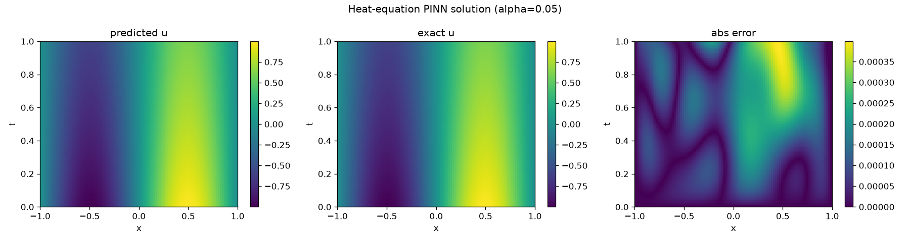
</p>

*The trained PINN (left) reproduces the closed-form heat-equation solution (centre); the absolute error
(right) peaks at ~4 × 10⁻⁴. The network learned the physics, not a lookup table.*

---

## TL;DR

- **A real solver.** A parametric PINN in JAX/Equinox solves the 1D heat equation across a continuous
  range of diffusivities `α ∈ [0.01, 0.1]` – one network, infinitely many PDE instances – validated
  against the analytical solution to **2.5 × 10⁻⁴** mean relative L2.
- **A real pipeline.** Training runs as an Azure ML command job; MLflow captures params/metrics/artifacts;
  an **evaluation gate** decides promotion; passing models land in a versioned **Model Registry**; one is
  served as a live **REST endpoint**.
- **Gates, not just training loops.** A deliberately under-trained config is run through the same gate and
  correctly **rejected** – nothing is registered. The registry's value *is* what it refuses to admit.
- **Local-first.** The identical train → gate → register scripts run against a local MLflow store with
  **zero Azure dependency**, so the whole thing is validated before any cloud round-trip.
- **Cost-disciplined.** CPU, scale-to-zero compute; the online endpoint was deployed, proven with a live
  call, then **torn down** – no resources left billing.

---

## 1. The science – a parametric PINN for the heat equation

The 1D heat equation with homogeneous Dirichlet boundaries and a sinusoidal initial profile:

```
∂u/∂t = α ∂²u/∂x²,    x ∈ [-1, 1],  t ∈ [0, 1]
u(x, 0) = sin(π x),   u(±1, t) = 0
```

A *physics-informed* network is trained not on labelled data but on the **PDE residual itself** – it
minimises how badly its own derivatives (taken with `jax.grad`) violate the equation at randomly sampled
collocation points. The model is **parametric in `α`**: inputs are `[x, t, α]`, output is `u`, so a single
network represents the entire family of solutions over the diffusivity range.

Two engineering decisions did the heavy lifting (see [python/pinn/model.py](python/pinn/model.py)):

- **Hard-constraint ansatz.** Instead of penalising boundary/initial-condition violations softly in the
  loss (where the optimiser trades them off against the residual), the output is structured as
  `u = sin(π x) + (1 − x²) · t · N(x, t, α)`. At `t = 0` this collapses to `sin(π x)`; at `x = ±1` the
  `(1 − x²)` factor kills it. The IC and BCs are therefore **exact by construction**, and the network `N`
  only has to learn the interior dynamics.
- **Input normalisation.** `α` lives in a narrow band of small numbers; feeding it raw gives the network a
  weak, low-variance gradient signal and it collapses toward an `α`-averaged solution. Normalising every
  input to ~`[-1, 1]` first is what lets it resolve the `α`-dependence at the edges of the range.

**Convergence:**

<p align="center">
  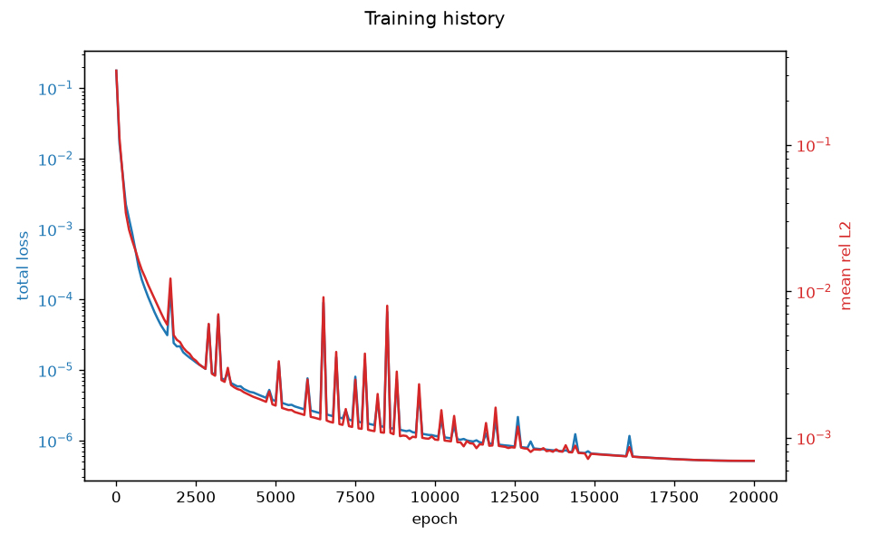
</p>

*Total PDE loss (blue) and held-out mean relative L2 (red) over 20 000 epochs. The spikes are the cosine
learning-rate restarts; the run settles below 10⁻⁶ loss / 2.5 × 10⁻⁴ relative error.*

**Breadth (in the core, outside the Azure ML pipeline):** the same architecture also solves **Burgers' equation**
(nonlinear, validated against a method-of-lines numerical reference since it has no closed form) and an
**inverse problem** – recovering an unknown diffusivity `α` from sparse, noisy observations, a
parameter-estimation task a classical forward solver cannot do directly.

---

## 2. Interactive frontend

A React + TypeScript app runs the trained model **entirely in the browser**. The Python training step
exports the network as plain JSON weights ([frontend/public/pinn_model.json](frontend/public/pinn_model.json))
and a TypeScript forward pass ([frontend/src/lib/inference.ts](frontend/src/lib/inference.ts))
re-implements it – no ONNX, no WASM runtime, no server.

> **Intended Tradeoff:** for a 3-layer tanh MLP, a ~30-line TS forward pass is smaller, dependency-free, and
> easier to debug than shipping an ONNX runtime to the client. This would be suboptimal for a larger model –
> it's a deliberate choice for *this* model's size.

---

## 3. The Azure MLOps pipeline

```
        ┌──────────────┐     ┌──────────┐     ┌─────────────────────┐     ┌──────────────┐     ┌──────────────┐
        │  Train job   │────▶│  MLflow  │────▶│   EVALUATION GATE   │────▶│    Model     │────▶│   Online     │
        │ (Azure ML    │     │ params,  │     │  held-out test set  │     │   Registry   │     │   endpoint   │
        │  CPU cluster)│     │ metrics, │     │  in-dist L2 < 1e-2  │     │ (passing     │     │ (REST, then  │
        │              │     │ artifacts│     │  AND  OOD  < 5e-2   │     │  models only)│     │  torn down)  │
        └──────────────┘     └──────────┘     └──────────┬──────────┘     └──────────────┘     └──────────────┘
                                                         │ FAIL
                                                         ▼
                                              register NOTHING, exit ≠ 0
```

**The evaluation gate is the crux of the MLOps pipeline.** A training loop that converges is necessary but not the only requirement to being promoted to the Model Registry.
**Promotion is a decision** made against a held-out test set, and **a model that doesn't clear the bar does not enter the Model Registry.**

### 3a. Training on Azure ML

The training entrypoint runs unchanged as an Azure ML command job on an existing **CPU,
scale-to-zero** cluster (`PINN-training-cluster`, `Standard_DS3_v2`). No GPU – this MLP trains in minutes.
MLflow auto-captures the run because Azure injects the tracking URI; the same script falls back to a local
`./mlruns` store off-cloud (see [§4](#4-local-first--the-same-scripts-run-anywhere)).

<p align="center">
  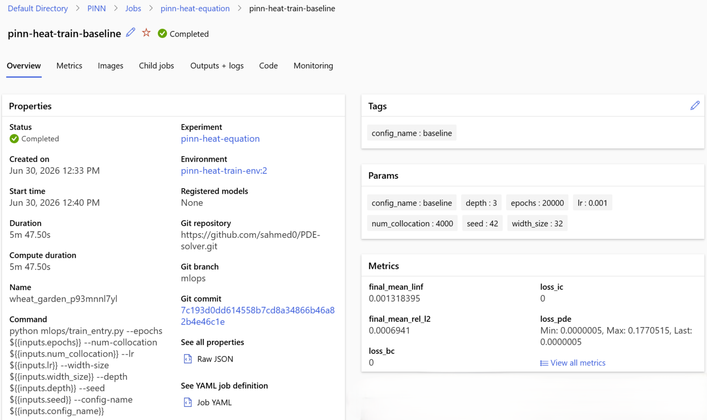
</p>

*A completed training job under the `pinn-heat-equation` experiment.*

<p align="center">
  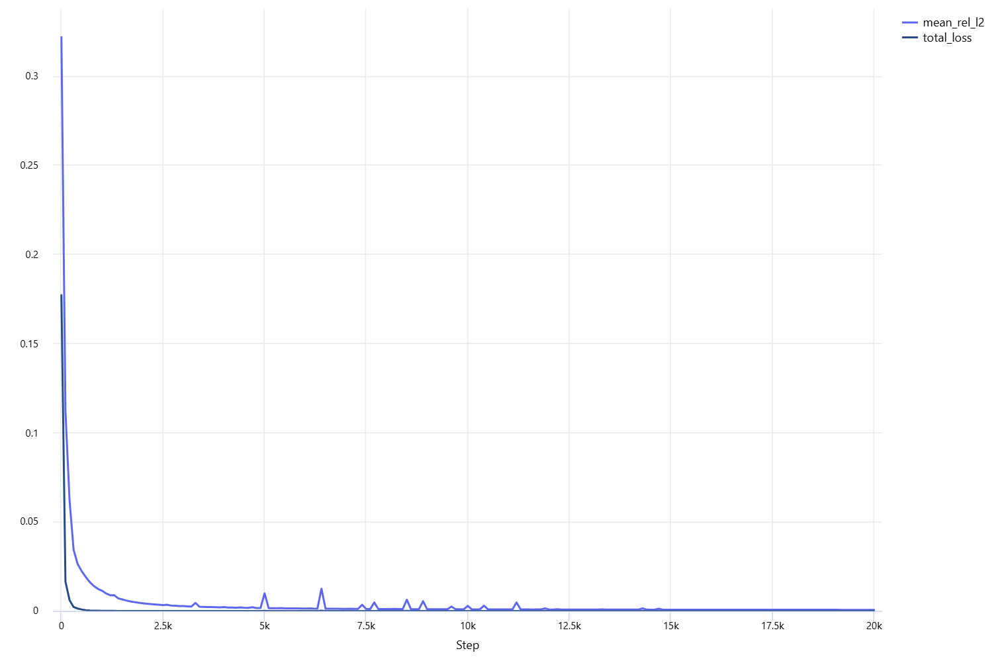
</p>

*The same loss history, captured automatically by MLflow and rendered in the portal.*

### 3b. The evaluation gate (the decision point)

The gate ([python/mlops/gate.py](python/mlops/gate.py)) reloads a trained model and scores it on a held-out
test set defined as two honest slices ([python/mlops/test_set.py](python/mlops/test_set.py)):

- **In-distribution interpolation** – diffusivities *inside* `[0.01, 0.1]` chosen not to coincide with the
  training-time validation values. Because training samples `α` *continuously and uniformly* over the range,
  these are genuine interpolation (not "unmemorised anchors"). This is the **primary promotion metric**.
- **Out-of-distribution extrapolation** – diffusivities *just outside* the trained band. This is the only
  truly held-out regime, where the analytical solution still provides ground truth. The threshold is looser
  because extrapolation is intrinsically harder.

A model is promoted **only if both** clear their thresholds: in-distribution mean rel-L2 `< 1e-2` **and**
OOD mean rel-L2 `< 5e-2`. The gate exits non-zero on failure so the terminal can branch on it.

<table>
<tr><th>✅ Baseline – PASS</th><th>❌ Weak config – FAIL</th></tr>
<tr><td>

<p align="center">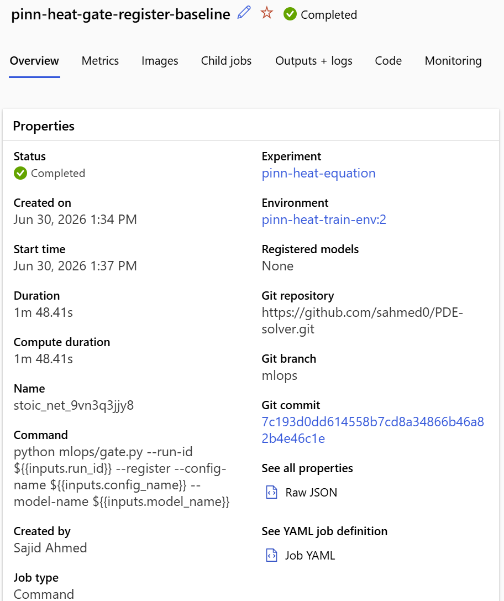</p>

</td><td>

<p align="center">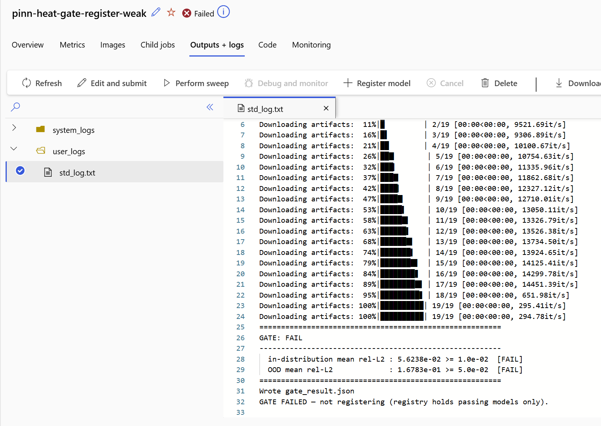</p>

</td></tr>
<tr><td>

`20 000` epochs → in-dist **2.48e-04**, OOD **6.09e-03**.
Both clear the bar with >8× margin → **registered**.

</td><td>

`--epochs 300 --num-collocation 150` → in-dist **5.62e-02**,
OOD **1.68e-01**. The log reads
*"GATE FAILED – not registering"* → **nothing promoted**.

</td></tr>
</table>

### 3c. The Model Registry

Only gate-passing models are registered, each tagged with its metrics and the run that produced it – so the
registry doubles as an audit trail.

<p align="center">
  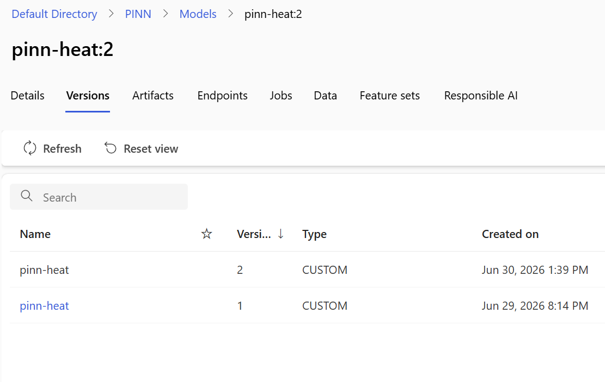
</p>

*`pinn-heat` versions 1 and 2 – both `baseline`. The failing weak run created **no** version; the gap is the
gate doing its job.*

<p align="center">
  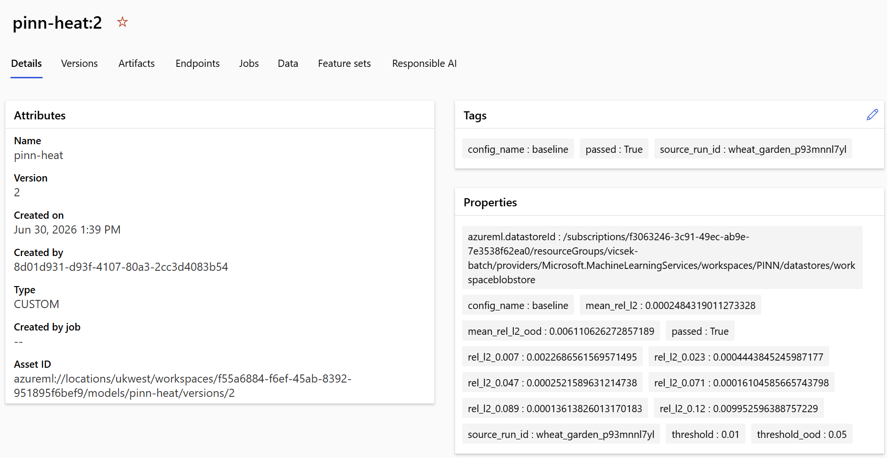
</p>

*Every promotion carries its evidence: `mean_rel_l2`, `mean_rel_l2_ood`, per-`α` errors, the thresholds it
cleared, `passed: True`, and `source_run_id` linking back to the producing run.*

### 3d. The live endpoint (deploy → test → tear down)

The registered model is served as a managed online REST endpoint, using a **dedicated inference environment**
(the training image has no HTTP scoring server – reusing it would fail to deploy after a slow provision). The
scoring script ([python/mlops/score.py](python/mlops/score.py)) accepts both a point list
`{"inputs": [[x,t,α], ...]}` and a grid request `{"grid": {"alpha", "nx", "nt"}}`.

<p align="center">
  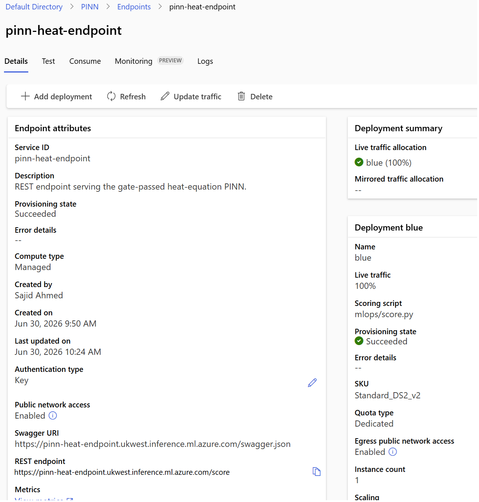
</p>

*`pinn-heat-endpoint` – Succeeded, key auth, 100% traffic to a single `Standard_DS2_v2` instance, REST API endpoint URL online*

<p align="center">
  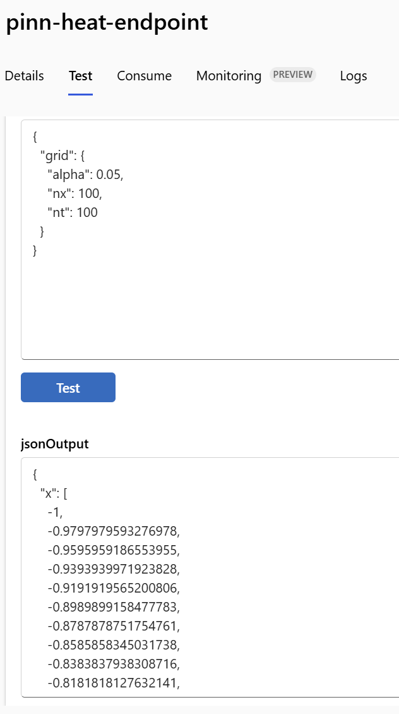
</p>

*A live grid request returns the full predicted field as JSON.*

<p align="center">
  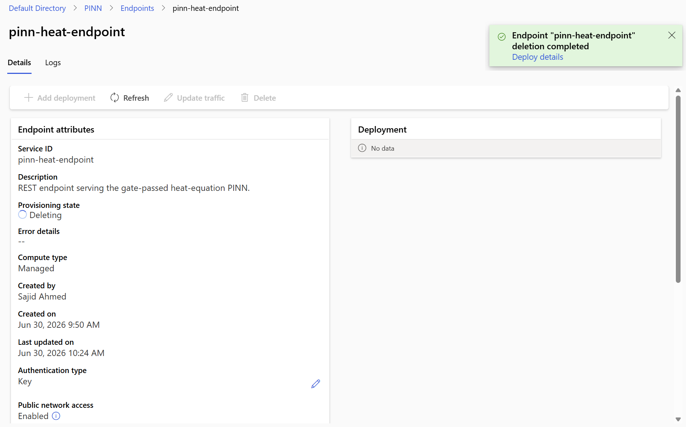
</p>

***Then torn down.*** Cost discipline is part of the deliverable – the happy path leaves nothing billing.

The scoring path is exercised offline before any cloud provision by a Docker smoke test
([python/scripts/docker_smoke.ps1](python/scripts/docker_smoke.ps1)) that builds the inference
conda env, rebuilds the model from the committed JSON, and times 50 point requests. Measured
scoring latency inside that local container (`Standard_DS2_v2`-class base image on a laptop,
**not** a cloud round-trip): p50 ≈ 6.11 ms, p95 ≈ 6.97 ms.

---

## 4. Local-first – the same scripts run anywhere

The single highest-risk seam in any MLOps project is "works on my machine vs works in the cloud." Here it's
collapsed to one rule in `setup_mlflow` ([python/mlops/logging_utils.py](python/mlops/logging_utils.py)): if
`MLFLOW_TRACKING_URI` is already set (Azure injects it inside a job), honour it; otherwise fall back to a
local `./mlruns` directory. The **exact same** `train_entry.py` / `gate.py` run in both worlds.

So the whole pipeline – train, gate, even register – is validated locally before any `az ml job create`:

<table>
<tr><th>✅ Local gate – PASS</th><th>❌ Local gate – FAIL</th></tr>
<tr><td>

<p align="center">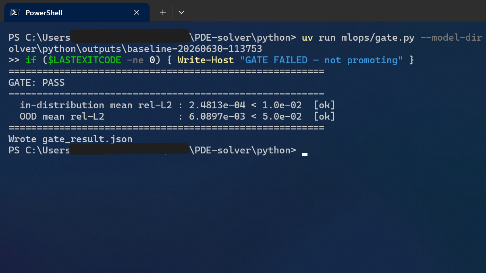</p>

</td><td>

<p align="center">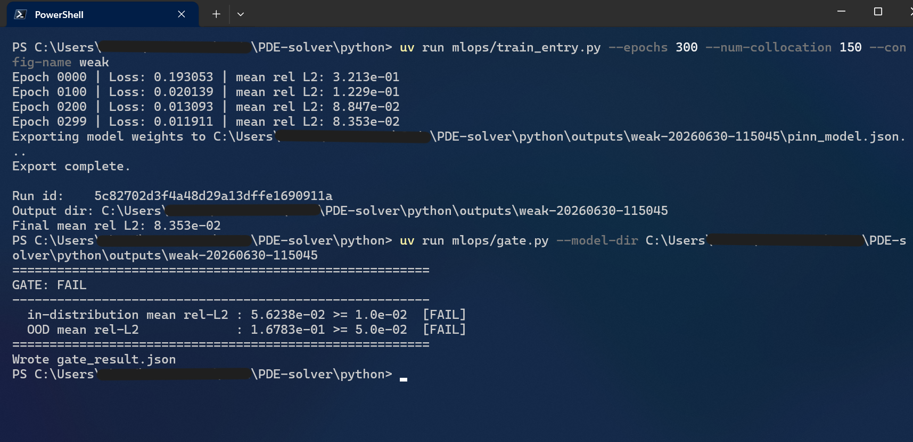</p>

</td></tr>
</table>

```powershell
# Train a baseline locally (CPU, a few minutes), then gate it.
cd python
uv run --group mlops python mlops/train_entry.py --epochs 20000 --config-name baseline
uv run --group mlops python mlops/gate.py --model-dir outputs/<run-dir>
if ($LASTEXITCODE -ne 0) { Write-Error "Gate failed – model not promotable" }

# Reproduce the rejection: a deliberately weak config that should FAIL the gate.
uv run --group mlops python mlops/train_entry.py --epochs 300 --num-collocation 150 --config-name weak
uv run --group mlops python mlops/gate.py --model-dir outputs/<weak-run-dir>   # exits non-zero
```

---

## 5. Repository layout

```
PDE-solver/
├─ python/
│  ├─ pinn/           # PINN core (installable package): model, physics (residual/loss), training, analytical solution
│  ├─ mlops/          # MLOps logic: train_entry, gate, test_set, serialization, score, logging_utils
│  └─ pytests/        # 37 tests – core + MLOps, all offline/fast (Azure SDK mocked)
├─ mlops/             # Azure ML assets: environment + job + endpoint + deployment YAML, runbook
├─ frontend/          # React + TypeScript web inference
└─ docs/              # screenshots and endpoint consumption examples
```

---

## 6. Engineering decisions & tradeoffs

The interesting parts of a project like this are the places where the obvious choice was wrong:

- **Hard-constraint ansatz over soft-loss BCs.** Baking the IC/BCs into the output structure made them exact
  *and* freed the optimiser to focus entirely on the interior residual – a large accuracy win over the
  weighted-penalty formulation, at the cost of an ansatz that's specific to this geometry.
- **The local↔cloud MLflow seam.** Built env-variable precedence *first*, so the cloud job needed
  zero Azure-specific code. This keeps everything in one codebase.
- **A dedicated inference environment.** Managed online deployments need an HTTP scoring server the training
  image doesn't carry. Discovering that *before* a 20–40 minute cloud provision (by smoke-testing the env in
  local Docker) is the entire point of the local-first discipline.
- **Equinox-native serialisation + source packaging.** Models persist as `.eqx` (+ an `architecture.json`
  skeleton). Because `eqx.tree_deserialise_leaves` rebuilds from the *live* class, the model source must be
  importable at scoring time – so the deployment uploads `python/` and `score.py` does the same `sys.path`
  bootstrap the rest of the package uses.
- **One metric definition, everywhere.** The gate's relative L2 is the *same* `relative_l2_error` the training
  loop reports – so "passes the gate" means exactly the same thing as "looked good in training." JAX returns
  arrays, not floats, so every metric is `float()`-cast before it touches JSON or the registry SDK.
- **Float32 vs gate margin.** JAX is float32 by default, so `mean_rel_l2` can wobble in its last digits across
  Windows-x86 (dev) and Linux (Azure). Negligible against a 1e-2 gate *because the baseline clears it with >8×
  margin* – thresholds were deliberately set well clear of the measured baseline, not within drift distance.

---

## 7. Running it yourself

**Local (no Azure needed):**

```powershell
cd python
uv sync --group mlops
uv run --group mlops pytest                 # 37 passing
uv run --group mlops python mlops/train_entry.py --epochs 20000   # train + log to ./mlruns
mlflow ui                                   # inspect runs/metrics/artifacts
```

**Frontend:**

```bash
cd frontend && pnpm install && pnpm dev
```

**Azure ML:** the full deploy/teardown runbook (env registration, job submission, registry promotion,
endpoint serving) lives in [mlops/README.md](mlops/README.md).

---

## 8. Status & honesty notes

- The pipeline is **terminal-driven by design** – submission is via the Azure ML CLI/SDK, not GitHub Actions.
  CI was explicitly out of scope; the gate is the quality control, run by hand or scriptable into CI later.
- The online endpoint shown above was **deleted after the screenshots** – it is not running and not billing.
- The "weak config" is a real, documented run, not a mock: it trains, it's evaluated by the identical gate,
  and it's rejected. The failing path is a first-class part of the demonstration, not an afterthought.
